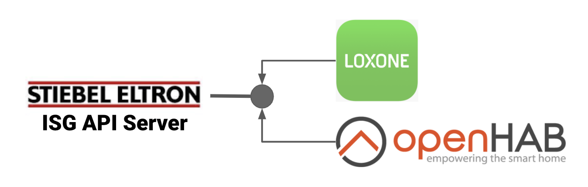

# Stiebel Eltron ISG API Server

Exposes the Stiebel Eltron ISG statistics and configuration values as REST API. 
Could be used to integrate Stiebel Eltron devices into home automation software like Loxone or OpenHAB.

## Usage guide
 * Download most current release binaries
 * Start the server and specify ISG IP address as first command line argument: `isg-apiserver-<TARGET-PLATFORM> <ISG IP address>`
 
## Available endpoints
 
**http://localhost:5432/stats**
Returns a JSON formatted document with all ISG-exposed statistics and configuration values.
 
**http://localhost:5432/value/val16?new=24.0**
Sets a new value for a configuration value. The following configuration values are available:

| Config value  | Path identifier |
| ------------- | ------------- |
| Temperatur Innenraum / Heizen Komforttemperatur  | val16  |
| Temperatur Warmwasser  | val22  |
| Heizen Eco-Temperatur  | val17  |
| Steigung Heizkurve  | val25  |
| Warmwasser Komforttemperatur  | val22  |
| Warmwasser Eco-Temperatur  | val23  |
